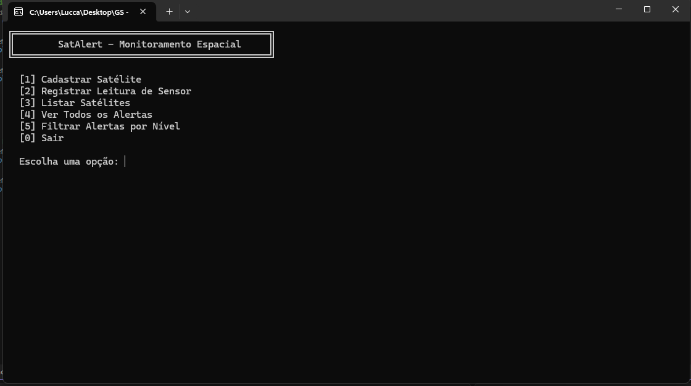
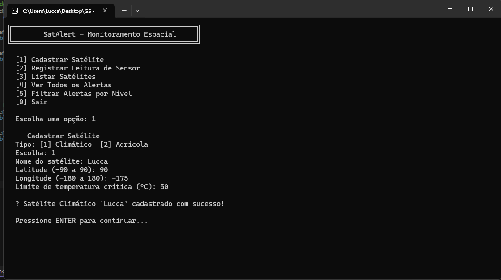
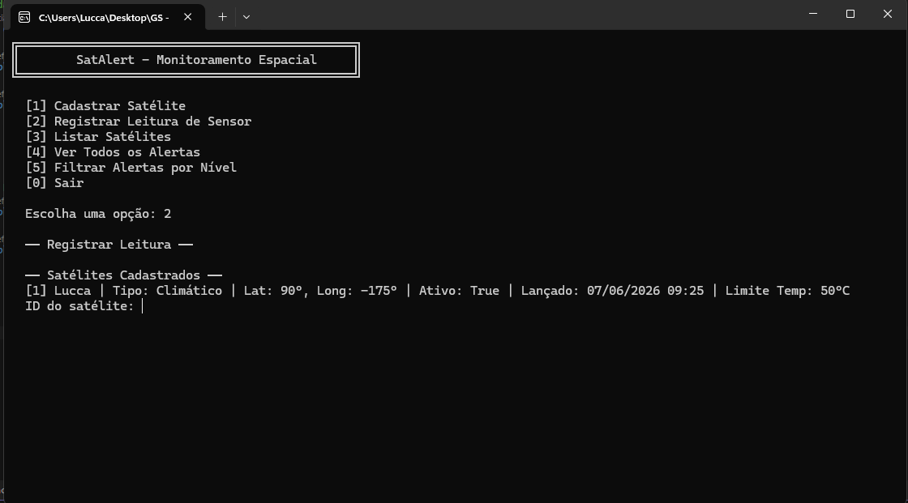
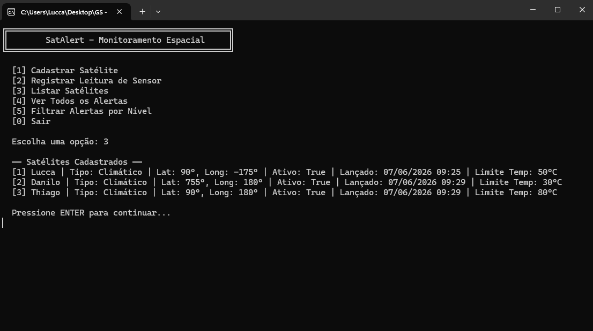

#  SatAlert — Sistema de Monitoramento de Satélites e Alertas

## Integrantes

| Nome | RM |
| Lucca Natario do Vale | RM95688 |
| Thiago Feltrin Geraldes | RM555805 |
| Danilo Affonso Luz Rios | RM554791 |


## Motivação do Projeto

A economia espacial está em plena expansão. Satélites hoje monitoram o clima, orientam o agronegócio e apoiam a prevenção de desastres naturais em escala global. O **SatAlert** surge como uma solução de software para simular esse monitoramento: um sistema que cadastra satélites, coleta leituras de sensores e gera alertas automáticos quando os valores ultrapassam limites críticos.

## Integração com o Tema

| Tema GS | Como o SatAlert atende |
|---|---|
| Monitoramento climático via satélite | Satélites Climáticos com limites de temperatura |
| Monitoramento agrícola com dados de satélite | Satélites Agrícolas com controle de umidade |
| Prevenção de desastres com dados espaciais | Geração automática de alertas por nível (Baixo / Médio / Crítico) |
| Plataformas de análise de dados orbitais | Histórico de leituras com DateTime e filtros por nível de alerta |

---

## Como Executar

### Pré-requisitos
- Visual Studio 2022 
- .NET 8 SDK instalado

### Passo a passo

1. Abra o Visual Studio
2. Clique em **"Abrir um projeto ou solução"**
3. Navegue até a pasta do projeto e selecione o arquivo `SatAlert.sln`
4. Pressione **F5** ou clique em **"Iniciar"** para executar

---

##  Estrutura de Pastas

```
SatAlert/
├── SatAlert.sln
└── SatAlert/
    ├── Program.cs                        ← Menu principal e injeção de dependência
    ├── Models/
    │   ├── Coordenada.cs                 ← Struct de coordenada geográfica
    │   ├── Satelite.cs                   ← Classe base abstrata
    │   ├── SateliteClimatico.cs          ← Herda de Satelite (polimorfismo)
    │   ├── SateliteAgricola.cs           ← Herda de Satelite (polimorfismo)
    │   └── Alerta.cs                     ← Modelo de alerta com enum de nível
    ├── Interfaces/
    │   └── ISensorService.cs             ← Interface para desacoplamento
    ├── Services/
    │   ├── SensorServiceBase.cs          ← Classe abstrata com lógica compartilhada
    │   └── SensorService.cs              ← Implementação concreta do serviço
    └── Repositories/
        ├── AlertaRepository.cs           ← Classe partial — armazenamento
        └── AlertaRepository.Queries.cs   ← Classe partial — consultas e filtros
```

---

##  Requisitos Técnicos Atendidos

| Requisito | Onde está no código |
|---|---|
| Classes públicas, privadas, estáticas | `Satelite.cs` (id estático, props private) |
| Herança | `SateliteClimatico` e `SateliteAgricola` herdam de `Satelite` |
| Polimorfismo | `ObterTipo()` e `ObterResumo()` sobrescritos em cada subclasse |
| Classe abstrata | `Satelite.cs` e `SensorServiceBase.cs` |
| Interface | `ISensorService.cs` |
| Injeção de Dependência | `Program.cs`: `ISensorService sensorService = new SensorService()` |
| DateTime | `DataLancamento`, `GeradoEm` em `Satelite` e `Alerta` |
| Tratamento de exceções | Try/catch no loop principal do `Program.cs` |
| Struct | `Coordenada.cs` |
| Classes partial | `AlertaRepository.cs` + `AlertaRepository.Queries.cs` |

---

# Diagrama de Fluxo

```
INÍCIO
  │
  └──► Menu Principal
         │
         ├──[1]──► Cadastrar Satélite
         │           ├── Escolher tipo: Climático ou Agrícola
         │           ├── Informar nome e coordenadas (lat/long)
         │           ├── Informar limite crítico (temperatura ou umidade)
         │           └── Salva na lista em memória
         │
         ├──[2]──► Registrar Leitura de Sensor
         │           ├── Selecionar satélite pelo ID
         │           ├── Informar valor da leitura
         │           └── SensorService analisa o valor
         │                 ├── Valor normal (< 80% do limite) → "Valores normais ✔"
         │                 ├── Valor médio (80–99% do limite) → Alerta MÉDIO ⚠
         │                 └── Valor crítico (≥ 100% do limite) → Alerta CRÍTICO 🚨
         │
         ├──[3]──► Listar Satélites
         │           └── Exibe todos com tipo, coordenadas, status e data
         │
         ├──[4]──► Ver Todos os Alertas
         │           └── Lista alertas com data/hora e nível
         │
         ├──[5]──► Filtrar Alertas por Nível
         │           ├── [1] Baixo
         │           ├── [2] Médio
         │           └── [3] Crítico
         │
         └──[0]──► Sair
```

---

## 🖼️ Evidências de Execução






---

## 📝 Observações

- Todos os dados são armazenados em memória durante a execução (sem banco de dados)
- O sistema nunca quebra abruptamente: todas as entradas são validadas com try/catch
- A injeção de dependência via interface `ISensorService` garante que o `Program.cs` não dependa da implementação concreta
